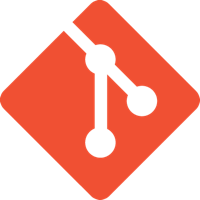

# Week 1: Intro to Course & Front-end Tools

> _Design is not just what it looks like and feels like. Design is how it works. –Steve Jobs_

## Table of Contents

<!-- START doctoc generated TOC please keep comment here to allow auto update -->
<!-- DON'T EDIT THIS SECTION, INSTEAD RE-RUN doctoc TO UPDATE -->
- [Day 1: Getting setup](#day-1-getting-setup)
  - [Concepts](#concepts)
  - [Tools & Technologies](#tools--technologies)
  - [Themes](#themes)
  - [Quiz 1: HTML/CSS Assessment](#quiz-1-htmlcss-assessment)
- [Day 2: Continue setup/tool introduction](#day-2-continue-setuptool-introduction)
  - [Intro to Version Control](#intro-to-version-control)
    - [What is Git/GitHub?](#what-is-gitgithub)
    - [GitHub Setup](#github-setup)
    - [Git/GitHub Concepts](#gitgithub-concepts)
      - [Repository](#repository)
      - [Branch](#branch)
      - [Commit](#commit)
      - [Push/Pull (Sync)](#pushpull-sync)
      - [Pull Request](#pull-request)
      - [Merge](#merge)
    - [GitHub development workflow](#github-development-workflow)
  - [Prepros](#prepros)
  - [Chrome DevTools](#chrome-devtools)
  - [Atom](#atom)
- [Homework: Getting familiar with GitHub](#homework-getting-familiar-with-github)

<!-- END doctoc generated TOC please keep comment here to allow auto update -->

## Day 1: Getting setup
In this course, we'll be focusing on intermediate-to-advanced front-end web development techniques and best practices. We'll be introducing the following concepts, tools, and technologies:

### Concepts
- **Responsive web design** (cross-device)
- **CSS authoring** (preprocessors)
- **CSS architecture/frameworks** (DRY/SMACSS)
- **HTML prototyping** (usability testing)
- **JavaScript** (interactive programming)

### Tools & Technologies
- _**Git & GitHub**_ for version control & collaboration
- _**Prepros**_ for CSS compiling and build processing
- _**Chrome DevTools**_ for advanced CSS/JavaScript debugging
- _**Atom**_ for text editing with built-in Git integration
- _**Codepen**_ for in-browser, front-end demonstrations and inspiration

The goal for this course is for each student to have a basic grasp of the tooling, yet a thorough understanding of the concepts as presented and their necessity in the web design & development process.

You'll also notice a few over-arching themes being repeated throughout the course that, while not core to curriculum, will provide a better understanding of how the development process works at large.

### Themes
- **Marketing vs product design** (website vs web-app)
- **Craftsmanship** (hacking)
- **Agile development**
- **Open-source software**
- **Contribution/Attribution** (on the web)

### Quiz 1: HTML/CSS Assessment

Render the pricing table image in HTML/CSS, including the product title, prices, details, and action items (buttons).

The styling of the page and pricing table should match the following screenshot:

[Pricing Table  (PNG)](https://d13yacurqjgara.cloudfront.net/users/25867/screenshots/842947/attachments/210494/pricing-table-01.jpg)

Fork the following project: [CodePen - Pricing Table](http://codepen.io/micjamking/pen/669f0200762bd219b2d26e9864de80d7/)

Post link to GitHub in the  [Quiz 1 discussion](https://github.com/kcc-nma-art258/assignments/issues/24)

Let's get started by introducing the foundational concept that will help us track and share our code, **version control**.

## Day 2: Continue setup/tool introduction

### Intro to Version Control

**Version control** (also known as **source control management**) is a system that records changes to a file or set of files over time so that you can recall specific versions later. Many popular systems include aspects of version control built-in to the software like word processors (ie. Google Docs, etc) and content management systems (ie. WordPress, etc).

- [Wikipedia: Revision Control](https://en.wikipedia.org/wiki/Revision_control)
- [Git SCM: Getting started - about version control](https://git-scm.com/book/en/v2/Getting-Started-About-Version-Control)

There's multiple types of version control systems available, including [CVS](http://www.nongnu.org/cvs/), [SVN](http://subversion.apache.org/), [Git](https://git-scm.com/) et al. Each system is catered to a specific type of workflow for collaboration, but generally all provide the same file versioning/history capabilities.

- [Wikipedia: List of types of version control](https://en.wikipedia.org/wiki/List_of_revision_control_software)

**Video: [Git Basics: What is Version Control?](https://vimeo.com/41027679)**

#### What is Git/GitHub?

**[Git](https://git-scm.com/) is the fastest growing and most popular version control system used to track and share documents today.**

Git provides common version control capabilities, but with it's own, unique organizational workflow. Git's [branching model concept](#branch) encourages a *feature-based workflow*, allowing people to seamlessly switch back and forth between different features they're working on and experiment without impacting the integrity of their code-base.

Git also allows groups of people to work on the same documents (often code) at the same time, and without stepping on each other's toes. It's a distributed, version control system.

**[GitHub](https://github.com/) is a web-based, Git repository hosting service. _(ie. a 'hub' for Git repo's, get it?)_**

Unlike Git, which is strictly a command-line (CLI) tool, GitHub provides a web-based graphical interface and desktop client for managing Git repositories.

GitHub also provides access control and several collaboration features such as bug tracking, feature requests, task management, and wikis for every project.

#### GitHub Setup

1. Sign up for a [free GitHub account](https://github.com/join)
  - Setup [Two Factor Authentication (2FA)](https://github.com/blog/1614-two-factor-authentication) as an additional security measure
2. Complete [ART258 GitHub account form](http://goo.gl/forms/QubL6AJy0F)
3. *Download [GitHub Desktop app](https://desktop.github.com/)
  - [GitHub for Mac](https://central.github.com/mac/latest)
  - [GitHub for PC](https://github-windows.s3.amazonaws.com/GitHubSetup.exe)

**The GitHub Desktop app should already be installed on the KOA 103 studio classroom computers.*

#### Git/GitHub Concepts
- [Git: The advantages of Git compared to other source control systems](https://git-scm.com/about/)
- [Git: Getting started - Git basics](https://git-scm.com/book/en/v2/Getting-Started-Git-Basics)
- [GitHub Help](https://help.github.com/)

##### Repository
A Git repository is nothing more than a directory (ie. folder) on a computer. Any file in your 'repo' will be tracked and a history of the changes will be recorded (unless [explicitly ignored](http://git-scm.com/docs/gitignore), which we'll talk about a bit later).

##### Branch
A Git branch is a working copy of your code, *in a specific state*. When you're working on a project, you're going to have a bunch of different features or ideas in progress at any given time – some of which are ready to go, and others which are not. Branching exists to help you manage this workflow.

##### Commit
A commit saves your current changes to your current branch. Once you start making changes in a repository, Git will start tracking those changes. Whenever you add, edit, or delete a file, you're making a commit, and adding them to your branch. This process of adding commits keeps track of your progress as you work on a feature branch.

##### Push/Pull (Sync)
A good practice in web development is to create backups of your projects. This is where _**GitHub**_ comes in, as a central repository hosting service for Git projects. Once you've wrapped up with your coding session, it's a good idea to sync your local repository with GitHub so all of your code changes are archived. If you're working on a team or between multiple machines, it's also a good idea to sync your local repository before you start working as well.

##### Pull Request
In the *[GitHub development workflow](#github-development-workflow)*, theres a `master` branch that keeps the final record of the code ready for deployment. To get code from our feature branches in to our master branch, we need to make a pull request.

##### Merge
In Git, merging brings the changes in two branches together. A pull request is a request to merge a set of commits from one branch in to another. Merges can be performed on your local machine to combine changes from two feature branches before syncing, and making a pull request to the `master` branch on Github.

#### GitHub development workflow

As we go through the semester, we'll cover different aspects of Git & GitHub within our workflow. At a [high-level](https://en.wikipedia.org/wiki/High-_and_low-level), we'll be following the [GitHub-Flow](https://guides.github.com/introduction/flow/) methodology for development with some slight adjustments for this course.

- Anything in the `master` branch is deployable
- To work on something new, create a descriptively named branch off of `master` (ie: `home-page-bug-fix`)
- Commit to that branch locally and regularly push (ie. sync) your work to the same named branch on GitHub
- When you need feedback or help, create an issue and mention myself and/or another student using the @username syntax (ie, @micjamking)
- When you are ready to submit your code assignment, create a pull request:
  - Have 2 other students review your work by mentioning them using the @username syntax in your pull request description (not the title!)
  - If your classmates find any issues, make the fixes locally and push the changes to the same remote branch
  - Once your code has been reviewed by 2 classmates and your code is ready to turn in, create a new comment on your pull request with the words `@micjamking: Final Submission`; this will send me a notification that your assignment is ready to be graded.

### Prepros

One of the bigger concepts of the semester will be authoring CSS using [Sass](http://sass-lang.com/). Sass (Syntactically Awesome Stylesheets) is a scripting language that preprocesses (ie. compiles in to) CSS. Sass extends CSS, providing features that are not yet available like variables, nesting of rules, mixins/functions, and operators to simplify our styling process and make our code more modular, scalable, and maintainable.

- [Wikipedia: Sass](https://en.wikipedia.org/wiki/Sass_(stylesheet_language))

Since browsers only read CSS in its original syntax, we need to use a program to compile our written Sass in to CSS so be served up to the browser. Similar to Git and other front-end tools, Sass was built as a command-line utility. In this course, we'll be using **[Prepros](https://prepros.io/)**, a third-party graphical user-interface (GUI) for CSS preprocessing, to assist us.

Along with Sass compiling, Prepros will also help out in other aspects of our web development build cycle, including:

- CSS prefixing
- Browser refresh & behavior synchronization
- File concatenation & minification
- Image optimization
- FTP client

We'll be diving in to this tool starting Week 2 and will cover each of the features above in detail in the subsequent weeks.

### Chrome DevTools

When developing a website or application using web technologies, it's necessary to be able to debug the site for issues while viewing it in the browser or on a device. [Google Chrome's Developer Tools](https://developers.google.com/web/tools/chrome-devtools/) (ie. Chrome DevTools) are a set of built-in authoring and debugging tools for web technologies (HTML/CSS/JavaScript).

Chrome Developer Tools (DevTools) helps you develop, test, and debug your web sites and applications directly from the Google Chrome browser. DevTools provides web developers the following capabilities which are essential to create usable, well functioning websites:

- Inspection of the Document Object Model (DOM) and styles of the currently running page.
- Debug JavaScript with breakpoints and the console.
- Interact with a page and record performance using the Timeline & Auditing tools.
- Test your pages on mobile using device emulation mode.

Chrome DevTools can also serve as a complete authoring environment, similar to traditional text editors like [Atom](#atom) or Sublime Text, however setup is an advanced topic and only certain aspects will be covered in this course.

If you're completely unfamiliar with the concept of debugging or have used other debuggers like Firebug but are inexperienced with Chrome DevTools, I highly recommend checking out the free online training course on [Chrome DevTools by Code School](https://www.codeschool.com/courses/discover-devtools). It's taught by [Paul Irish](http://www.paulirish.com/), one of the Chrome Developer team members, but uses [Code Schools](https://www.codeschool.com/) highly interactive, educational platform, so I find it more approachable than the Chrome DevTool documentation as an introduction to the tool.

We'll be covering different aspects and topics on Chrome DevTools throughout the semester as we go through the web development process.

### Atom

**[Atom](https://atom.io/) is a "hackable text editor for the 21st century".** Similar to *[Adobe Dreamweaver](http://www.adobe.com/products/dreamweaver.html)*, *[Brackets](http://brackets.io/)*, *[Sublime Text](http://www.sublimetext.com/)*, and *[Textmate](https://macromates.com/) (for OSX)*, Atom is a standalone text editor built for coding/programming. However, unlike the above editors, Atom comes with [built-in Git integration](https://atom.io/docs/v1.0.7/using-atom-version-control-in-atom), is [completely customizable](https://atom.io/docs/v1.0.7/hacking-atom-tools-of-the-trade) through JavaScript & CSS, and best of all, is [open-source](http://blog.atom.io/2014/05/06/atom-is-now-open-source.html) (ie. free).

**Video: [GitHub presents: Atom 1.0](https://youtu.be/Y7aEiVwBAdk)**

As a web developer, a text editor is your primary tool for crafting sites and apps, so finding an editor that you're comfortable with and is configurable to match your workflow is important.

Below are a few features which are important to have in a text editor.
- Autocompletion
- File browser/file search
- Extensibility/plugins for additional functionality
- Theming

Along with the above features, Atom also includes [integration with Git](https://atom.io/docs/v1.0.7/using-atom-version-control-in-atom), providing the following additional capabilities:
- Quickly rewind to a previous commit (`cmd-alt-z`)
- Display the list of all the untracked (ie. new) and modified files in the project (`cmd-shift-b`)
- Edit commit messages (if using Git CLI)
- Highlight the status of our untracked and modified files within the tree-view, gutter and status bar of the Atom interface.  

Students may use any text editor they prefer for this course, however Atom will assist in learning the Git concepts and can be configured to fit any particular workflow. It is recommended to atleast try the editor for the initial few weeks, since it will be used for presenting the exercises and should be easier to follow along with.

## Homework: Getting familiar with GitHub

- Create a local repository called `inspiration` (it can be whatever you want) and add a `README.md` file. In the file, add a link to something that inspires you online. Sync this with your GitHub account online by 11:59pm Wednesday night.
- Read the [GitHub Guides](https://guides.github.com/) _(approx. 1 hr 23 min of reading)_. Specifically:
  - [GitHub Flow](https://guides.github.com/introduction/flow/)
  - [Hello World](https://guides.github.com/activities/hello-world/)
  - [Getting your project on GitHub](https://guides.github.com/introduction/getting-your-project-on-github/)
- Review links from Day 2 outline (above)
