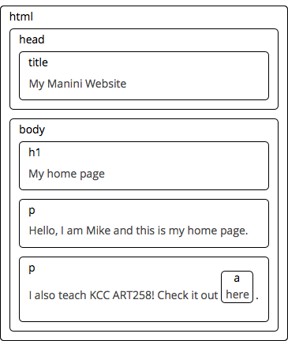

# Week 13: Introduction to JavaScript (Part 3)

We've spent the last two weeks wrapping our heads around basic programming concepts. This week we'll focus on JavaScript's role in the browser and how we can use the previous concepts we discussed, along with browser specific features, like the _Document Object Model (DOM)_, Events, and Storage to start building functionality in our web pages. 

**Table of Contents**

<!-- START doctoc generated TOC please keep comment here to allow auto update -->
<!-- DON'T EDIT THIS SECTION, INSTEAD RE-RUN doctoc TO UPDATE -->


  - [The Document Object Model (DOM)](#the-document-object-model-dom)
    - [Finding Elements](#finding-elements)
    - [Manipulating Elements](#manipulating-elements)
      - [Hide element](#hide-element)
      - [Show element](#show-element)
      - [Add (inline) CSS styles](#add-inline-css-styles)
      - [Get (stylesheet) CSS styles](#get-stylesheet-css-styles)
      - [Get Element Width/Height](#get-element-widthheight)
      - [Get Element Position (relative to viewport)](#get-element-position-relative-to-viewport)
      - [Add class to element](#add-class-to-element)
      - [Remove class from element](#remove-class-from-element)
      - [Has Class (returns true or false)](#has-class-returns-true-or-false)
      - [Get Text](#get-text)
      - [Set Text](#set-text)
      - [Get HTML](#get-html)
      - [Set HTML](#set-html)
      - [Get Attribute](#get-attribute)
      - [Set Attribute](#set-attribute)
      - [Create new element](#create-new-element)
      - [Create content (text)](#create-content-text)
      - [Append element (insert at end)](#append-element-insert-at-end)
      - [Prepend element (insert at beginning)](#prepend-element-insert-at-beginning)
      - [Remove element](#remove-element)

<!-- END doctoc generated TOC please keep comment here to allow auto update -->

## The Document Object Model (DOM)

When you open a web page in your browser, the browser retrieves the page’s HTML text and parses it. The browser builds up a _model_ of the document’s structure and then uses this model to draw the page on the screen.

This _model_ of the document is one of the browser features that JavaScript has access to: you can read from the model and also change it. The DOM acts as a live data structure: when it is modified, the page on the screen is updated to reflect the changes.

**Example: `index.html`**

```html
<!DOCTYPE html>
<html lang="en">
  <head>
    <title>My Manini Website</title>
  </head>
  <body>
    <h1 id="title">My home page</h1>
    <p>Hello, I am Mike and this is my home page.</p>
    <p class="description">I also teach KCC ART258! Check it out
      <a href="https://github.com/kcc-nma-art258">here</a>.</p>
  </body>
</html>
```

**This page has the following _DOM_ structure:**



For each box, there is an **object**, which we can interact with to find out things such as what HTML tag it represents and which boxes and text it contains. This representation is called the _Document Object Model_, or DOM for short.

In JavaScript, the DOM is typically referred to as a tree structure, because

### Finding Elements

In JavaScript, there is a global variable called `document`, which gives us access to the DOM of an HTML page. The `document` object also contains a number of _methods_, or properties that refer to functions (like `console.log()`), which we can use to access and manipulate properties of the elements.

For example, if we wanted to find the `href` value of the link in our above example, we could do the following:

```js
var link = document.querySelectorAll('a')[0];

console.log(link); // <a href="https://github.com/kcc-nma-art258">here</a>
console.log(link.href); // https://github.com/kcc-nma-art258
```

`querySelectorAll` is a method available to all element nodes, which searches within the element (in our case `document`) and finds an element using any valid CSS selector. The `querySelectorAll` method returns an array of elements which match the query. _(If there is a single match, it will be available in the zero position of the returned array)_

We can access each element in the `body` of our document like so:

```js
var title = document.querySelectorAll('#title')[0];
var intro = document.querySelectorAll('p')[0];
var descr = document.querySelectorAll('.description')[0];
var link  = document.querySelectorAll('a:link')[0];

console.log(title.innerHTML); // My home page
console.log(intro.innerHTML); // Hello, I am Mike and this is my home page.
console.log(descr.innerHTML); // I also teach KCC ART258! Check it out <a href="https://github.com/kcc-nma-art258">here</a>.
console.log(link.innerHTML); // here
```

As you can see in the above, we can display the inner content of each element using the `element.innerHTML` property. Note that if the HTML element contains further nested HTML, `element.innerHTML` will output the nested HTML elements as well.

**So, how do we display just the text?**

```js
console.log(descr.textContent);
```

There are quite a few properties and _methods_ available for elements, so you can refer to the below resources to learn more about what the properties available

**Resources:**
- [Document | MDN](https://developer.mozilla.org/en-US/docs/Web/API/Document)
- [Element | MDN](https://developer.mozilla.org/en-US/docs/Web/API/Element)

### Manipulating Elements

Given the following HTML elements and JS variables...

```html
<header class="main-header">
  <h1 id="title">My Company Name</h1>
</header>
```

```js
var el     = document.querySelectorAll('#title')[0];
var parent = el.parentNode; // This will grab the immediate parent element of `el`
```

Below is a list of common tasks that you may like to perform using JavaScript:

#### Hide element

```js
el.style.display = 'none';
```

#### Show element

```js
el.style.display = '';
```

#### Add (inline) CSS styles

```js
el.style.borderColor = 'red';
```

#### Get (stylesheet) CSS styles

```js
getComputedStyle(el).getPropertyValue('height');
```

#### Get Element Width/Height

```js
el.offsetHeight;
el.offsetWidth;
```

#### Get Element Position (relative to viewport)

```js
el.getBoundingClientRect();
```

_(CSS properties with hyphens like `border-color` are camelCase when accessing them in JavaScript.)_

#### Add class to element

```js
var className = 'my-new-class';
// IE 10
if (el.classList){
  el.classList.add(className);
} else {
// IE 8+
  el.className += ' ' + className;
}
```

#### Remove class from element

```js
var className = 'my-new-class';
// IE 10
if (el.classList){
  el.classList.remove(className);
} else {
// IE 8+
  el.className = el.className.replace(new RegExp('(^|\\b)' + className.split(' ').join('|') + '(\\b|$)', 'gi'), ' ');
}
```

#### Has Class (returns true or false)

```js
var className = 'my-new-class';
// IE 10
if (el.classList){
  el.classList.contains(className);
} else {
// IE 8+
  new RegExp('(^| )' + className + '( |$)', 'gi').test(el.className);
}
```

#### Get Text

```js
el.textContent;
```

#### Set Text

```js
el.textContent = 'My New Company Name';
```

#### Get HTML

```js
parent.innerHTML;
```

#### Set HTML

```js
parent.innerHTML = '<h2 class="subtitle">My Other Company Name</h2>';
```

#### Get Attribute

```js
el.getAttribute('id'); // title
```

#### Set Attribute

```js
el.setAttribute('alt', 'This is My Heading');
```

You can also create new elements and dynamically insert and remove them from the page.

#### Create new element

```js
var newDiv = document.createElement("div"); 
```

#### Create content (text)

```js
var newContent = document.createTextNode("Hi there and greetings!");
```

#### Append element (insert at end)

```js
newDiv.appendChild(newContent); // Adds content to newly created div
parent.appendChild(newDiv); // Adds newDiv to DOM (live HTML page), after our h1.title
```

#### Prepend element (insert at beginning)

```js
parent.insertBefore(newDiv, parent.firstChild); // Adds newDiv to DOM, before our h1.title
```

#### Remove element 

```js
parent.removeChild(el);
// or if you don't know the parent element
el.parentNode.removeChild(el);
```