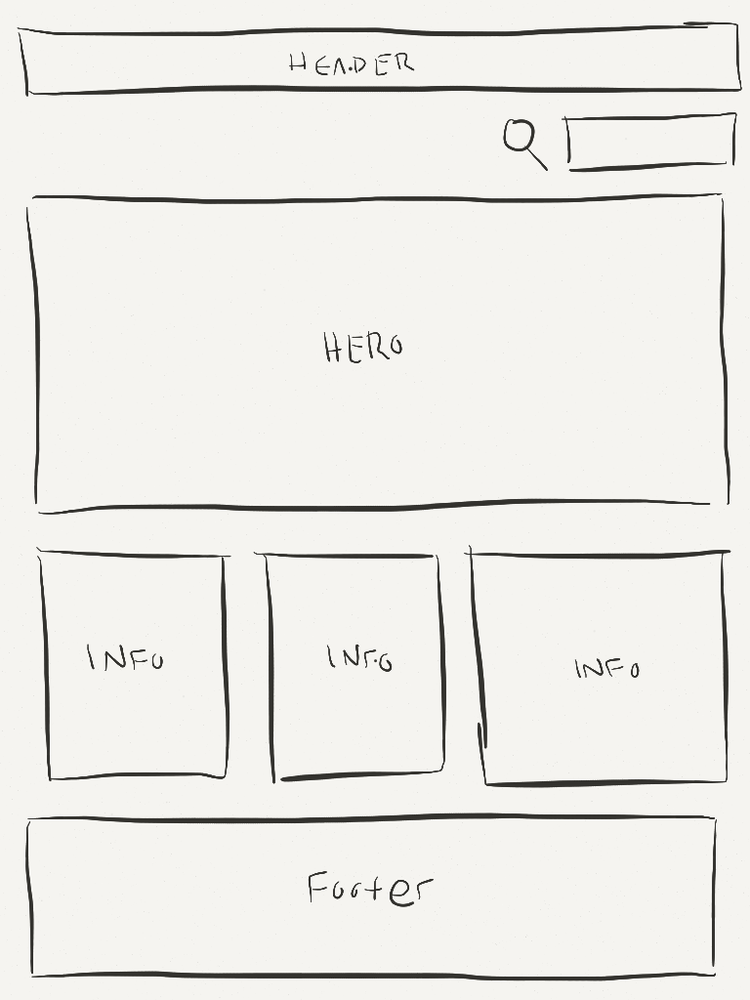

# Week 2: Review of Basic Web Development Techniques

## Table of Contents

<!-- START doctoc generated TOC please keep comment here to allow auto update -->
<!-- DON'T EDIT THIS SECTION, INSTEAD RE-RUN doctoc TO UPDATE -->
- [Day 3: HTML/CSS Review](#day-2-htmlcss-review)
  - [Fork kcc-nma-art258/assignments](#fork-kcc-nma-art258assignments)
  - [Creating a basic HTML page](#creating-a-basic-html-page)
    - [Declare your !DOCTYPE](#declare-your-doctype)
    - [Create your opening and closing HTML tags.](#create-your-opening-and-closing-html-tags)
    - [Break your down page structure](#break-your-down-page-structure)
    - [IDs vs Classes (ie. serial number vs barcodes)](#ids-vs-classes-ie-serial-number-vs-barcodes)
    - [Let’s start to style](#let%E2%80%99s-start-to-style)
    - [Linking your stylesheet](#linking-your-stylesheet)
    - [Testing](#testing)
    - [Styling sections](#styling-sections)
    - [Reset browser default styling](#reset-browser-default-styling)
    - [Content Area and Centering](#content-area-and-centering)
    - [Adding a logo and navigation](#adding-a-logo-and-navigation)
    - [Absolute positioning elements](#absolute-positioning-elements)
    - [Create columns](#create-columns)
    - [Floating](#floating)
    - [Clearing](#clearing)
    - [More Pseudos](#more-pseudos)

<!-- END doctoc generated TOC please keep comment here to allow auto update -->

## Day 3: HTML/CSS Review

### Fork [kcc-nma-art258/assignments](https://github.com/kcc-nma-art258/assignments)
- [Forking a repository on GitHub](https://help.github.com/articles/fork-a-repo/)
- [Cloning a repository from GitHub Desktop](https://help.github.com/desktop/guides/contributing/cloning-a-repository-from-github-desktop/)
- Open Atom (or your text editor) and add the **assignments** folder to your project tree view by clicking _'File > Add Project Folder...'_ or using the `cmd-shift-o` keyboard shortcut.
- Navigate to __week-1/exercise/__ and open the `index.html` and `style.css` files
- In GitHub Desktop, create a new branch called `week-2-assignments`; we'll be working off of this branch for this week.

### Creating a basic HTML page

**Topics Covered**
- Basic HTML structure
- CSS linking
- ID's versus Classes
- Practical naming
- Positioning
  - Relative
  - Absolute
  - Fixed
- Floats
  - Clearing floats
- Pseudo-elements
  - `:before`/`:after`
- Pseudo-classes
  - `:first-child`/`:last-child`
  - `:nth-child()`

#### Declare your !DOCTYPE
This tells the browser what version of HTML you are using and must come before the HTML tag. The HTML5 !DOCTYPE is the simplest to remember:

```html
<!DOCTYPE html>
```

#### Create your opening and closing HTML tags.
This is where all your HTML will go.

```html
<!DOCTYPE html>
<html>
  ...
</html>
```

Create your opening and closing `<head>` and `<body>` tags.
The `<head>` tag must include a title for the document. The head is also where you will include your stylesheets (ie. `<link />`) and meta tags (ie. `<meta />`) for the site. You can also include scripts in the `<head>` tag, however it's highly recommended that you place your scripts just above your closing `</body>` tag for performance reasons. In your `<head>` tag, you will need to declare what type of character set you will be using for the document.

```html
<meta charset="UTF-8">
```
You will need to also give your page a `<title>` tag.

```html
<title>My First In Class Assignment</title>
```

The `<body>` tag will define the document’s body and where your HTML will be.

```html
<head>
  <meta charset="UTF-8">
  <title>My First In Class Assignment</title>
</head>
<body>
  ...
</body>
```
All together now.
```html
<!DOCTYPE html>
<html>
<head>
  <meta charset="UTF-8">
  <title>My First In Class Assignment</title>
</head>
<body>
  ...
</body>
</html>
```

#### Break your down page structure

[Kahala Mall Center](http://www.kahalamallcenter.com/)

Study this page structure and understand how things can be broken down into sections. By keeping everything simple, we can grasp the general layout and work on the details later.



Our website has 5 main sections:

- header
- search
- hero section
- information
- footer

Let’s think about every section as a separate element and divide them accordingly within our HTML. It's also helpful to create comments to keep track of each element.

```html
<!DOCTYPE html>
<html>
<head>
  <meta charset="UTF-8">
  <title>My First In Class Assignment</title>
</head>
<body>

  <!-- Header Section -->
  <header>
  </header>

  <!-- Search Section -->
  <section>
  </section>

  <!-- Hero Section -->
  <section>
  </section>

  <!-- Information Section -->
  <section>
  </section>

  <!-- Footer Section -->
  <footer>
  </footer>

</body>
</html>
```

#### IDs vs Classes (ie. serial number vs barcodes)

`id`: unique identifiers _(serial number)_
- Only one ID per element
- Only one ID of that kind per page
- Browser will navigate (scroll to) element with ID in url (ie. http://yourdomain.com#comments)

`class`: reusable classifiers _(barcodes)_
- Same class on multiple elements allowed
- Multiple classes on same elements allowed

**When should you use an ID versus a Class?**

**Rule of thumb:** use id's for behavior and classes for styling

An element can have both an `id` and a `class`, so start with a `class`. If you need something to be unique for a specific behavior (like navigation), add a unique `id` for that page.

```html
<!DOCTYPE html>
<html>
<head>
  <meta charset="UTF-8">
  <title>My First In Class Assignment</title>
</head>
<body>

  <!-- Header Section -->
  <header class="main-header">
  </header>

  <!-- Search Section -->
  <section class="search">
  </section>

  <!-- Hero Section -->
  <section class="hero">
  </section>

  <!-- Info Section -->
  <section class="site-info">
  </section>

  <!-- Footer Section -->
  <footer class="main-footer">
  </footer>

</body>
</html>
```

**Question:** What would be the final background color of our `<header class="main-header"></header>` element if we also added an ID of *main-header*, (ie. `id="main-header"`) with the following CSS rules applied?

```css
 #main-header {
   background-color: green;
 }

 .main-header {
   background-color: blue;
 }

 header {
   background-color: purple;
 }
```

Now is a good point to save what we have in Git & sync with github.com before we continue. It is considered good practice to make frequent commits (ie. save in git) while you're working, but reserve syncing until you complete a feature branch or you're finished working for the moment (whichever comes first).

#### Let’s start to style

Create your stylesheet and save it in a folder called `styles`. The folder should live in the same directory as your home page `index.html`. What you name your stylesheets is up to you, but let’s keep it simple and call it `style.css`.

You should now have a folder named `styles` with a file called `style.css` within it.

#### Linking your stylesheet

In your `index.html`, link your stylesheet in the `<head>` of your document as such:

```html
<!DOCTYPE html>
<html>
<head>
  <meta charset="UTF-8">
  <title>My First In Class Assignment</title>
  <link rel="stylesheet" href="styles/style.css">
</head>
...
```
**Question:**
*If we moved `styles.css` out of the `styles` folder and in to the parent directory with `index.html` what would the new link be?*

#### Testing
In your `style.css`, give the body a background color of your choice.

```css
body {
  background-color: #FFCC00;
}
```

Open your `index.html` file in your browser and confirm the background color was applied to the web page.

#### Styling sections
Let’s add more styling to the page. Since there is no content yet, none of the elements we created are being shown. We need to add a height to each element:

```css
.main-header {
  height: 60px;
  background-color: green;
}

.search {
  height: 60px;
  background-color: orange;
}

.hero {
  height: 460px;
  background-color: red;
}

.site-info {
  height: 260px;
  background-color: purple;
}

.main-footer {
  height: 200px;
  background-color: blue;
}

```
**Question:**
What would be the best way (most efficient/fastest) way if I wanted to apply the same styling to multiple elements?

#### Reset browser default styling
All browsers will apply a default styling to elements thats slightly different from each other so we need to 'reset' the styles so we can start from a consistent place cross-browser.

A very simple reset can be something like this:
```css
*,
*:before,
*:after {
  margin: 0;
  padding: 0;
}
```
However, this can be over simplistic and incomplete. There are additional CSS resets avaialble which also supply a handy set of defaults for things like typography and form controls. Lets take a look at [Eric Meyer's CSS Reset](http://meyerweb.com/eric/tools/css/reset/).
A copy is included in this repo here: [reset.css](exercise/reset.css)


Let's move the reset to our `styles` directory. This new file should be declared before our `style.css` file so we start with a clean document, free of any default browser styling.

```html
<head>
  <meta charset="UTF-8">
  <title>My First In Class Assignment</title>
  <link rel="stylesheet" href="styles/reset.css">
  <link rel="stylesheet" href="styles/style.css">
</head>
```

There are also other CSS resets available, including:
- [normalize.css](https://github.com/necolas/normalize.css/)
- [HTML5 Doctor reset](http://html5doctor.com/html-5-reset-stylesheet/)
- [Yahoo's YUI3 reset](https://github.com/yui/yui3/blob/master/src/cssreset/css/cssreset.css)

#### Content Area and Centering

Let’s add container area around all of the sections and give it a width, add a background color, and center it. Make the width 960px.

**index.html**
```html
<div class="container">
  <!-- Header Section -->
  <header class="main-header">
  </header>

  <!-- Search Section -->
  <section class="search">
  </section>

  <!-- Hero Section -->
  <section class="hero">
  </section>

  <!-- Info Section -->
  <section class="site-info">
  </section>

  <!-- Footer Section -->
  <footer class="main-footer">
  </footer>
</div>
```

**style.css**
```css
.container {
  width: 960px;
  margin: 0 auto;
  background: white;
}
```

#### Adding a logo and navigation
Within our header, add one `<div>` element and one `<nav>` element. One will be your logo and one will be your main navigation. Give them a class.

```html
<header class="main-header">
  <div class="logo">
  </div>

  <nav class="main-nav">
  </nav>
</header>
```
Once these items have been added, give each one a width, height and background color in your css.

```css
.logo {
  height: 60px;
  width: 100px;
  background: gray;
}

.main-nav {
  height: 60px;
  width: 400px;
  background: purple;
}
```
Add content or text within each element. For the `.main-nav` element, you will need to add an unordered list of items to replicate the navigation.

#### Absolute positioning elements
We need to practice different positioning. Under the normal circumstances, you will probably not want to position items absolute unless you need them to be in a very specific location.

In your css, add `position: absolute;` to your `.logo` and `.main-nav`. If you position something absolute, it will remove the element out of normal flow (how a browser normally renders something) and will reposition it on the page and will not affect any element around it.

Now, add `top: 0;` and `left: 0;` to your `.logo`.

```css
.logo {
  width: 100px;
  height: 40px;
  background: gray;
  position: absolute;
  top: 0;
  left: 0;
}
```

**What happens?**

Now try to position the main navigation absolute with a `top: 0;` and `right: 0;`.

**What happens?**

Absolute position looks for the first parent element which has `position: relative;` applied to it and will reposition it’s coordinates based on that parent element.

**Question:**
How do we bring the two elements (logo and main nav) back into the container?

#### Create columns
Let’s skip the search bar row and move on to the next HTML section. Create three `<div>` within the proper wrapper.
```html
<section class="site-info">
  <div class="info-01 columns">
  </div>
  <div class="info-02 columns">
  </div>
  <div class="info-03 columns">
  </div>
</section>
```
How wide should each column be? Add a `width: 25%;` to `.info-01` and `.info-02` and `width:50%;` to `.info-03`, a `height: 100px` to each one, and a unique background color to each element.

#### Floating
To make all items display inline to each other in a row, we need to float them. In layman's terms, floating takes an element out of normal flow and moves them either to the far left or far right (depending on how you float the element).

**Try this:**
- Float all elements left
- Float all elements right.
- Change the widths to all three elements to 60% and keep the float right.
- Change everything back to the original widths (50% and 25%) and make `.info-01` `float: left` and `.info-02` and `.info-03` `float: right`.

Resources:
- [CSS Trick: All About Floats](http://css-tricks.com/all-about-floats/)

#### Clearing
Any time you float an element, it takes it out of normal flow and will position it according to how you specify it. To reset the flow of content, you need to clear your floats.
In the past, a common technique would be to add an empty element after all of the floats and in your css put `clear:both;` to remove all floats. That creates unnecessary markup and isn't scalable.

For your main section `.site-info` element, add a style declaration of `height: auto;`. Let’s say we don’t know how tall the content area will be. What happens?
Because the content is removed from normal flow, the main div thinks there is nothing in it, so it collapses the height to 0.

How do we get our parent element `.site-info` to show up again?

Nicolas Gallagher came up with a great [micro clearfix hack](http://nicolasgallagher.com/micro-clearfix-hack/). We will add the rule in the beginning of our CSS document as follows:
```css
.cf:before,
.cf:after {
  content: "";
  display: table;
}

.cf:after {
  clear: both;
}
```
...and add the new `.cf` class to our markup...
```html
<section class="site-info cf">
...
</section>
```
The `.cf:after` selector may look unfamiliar, but it reads as follows
> _All pseudo `:after` elements belonging to an element with the class `.cf`._

The `:after` is known as a CSS _pseudo-class_. This type of pseudo class is only available in IE8+ and other modern browsers.

Now, if you have floats in anything with the class of `.site-info`, it will automatically clear it and you don’t have to worry about setting a height.

_Note: Clearing only works on floats, not elements positioned absolutely._

#### More Pseudos
Let’s clean up our HTML and how everything looks. Each column should have some spacing, so let’s change the width from 50% to 49% and 25% to 24%.

Let’s give each column a left margin of 1% by adding it to our `.column` class.
```css
.site-info .columns {
  height: 100px;
  margin: 0 0 0 1%;
}

.site-info .info-01,
.site-info .info-02 {
  width: 24%;
}

.site-info .info-03 {
  width: 49%;
}
```

Now, we have margin on both elements, but we don’t need a margin on the first element. How do we get rid of it? Let’s use `:first-child`, a _pseudo-class_.

`element:first-child` applies style rules to the first element of the matched elements.

```css
.column:first-child {
  margin: 0;
}
```

_Note: `:last-child` is [not supported](http://caniuse.com/#search=last-child) in early versions of IE8, so confirm your browser support before implementing._

`:nth-child()`

What about making odd columns a different color?
```css
element:nth-child(odd) {
  background: red;
}
```
What about making only the second column a different color?
```css
element:nth-child(2) {
  background: red;
}
```
What about making every sixth column a different color?
```css
element:nth-child(6n) {
  background: red;
}
```

**References:**
- [Mozilla: Writing Efficient CSS](https://developer.mozilla.org/en-US/docs/Web/Guide/CSS/Writing_efficient_CSS)
- [CSS Specificity](http://www.standardista.com/wp-content/uploads/2012/01/specificity3.pdf)

## Homework: Creating layouts in HTML/CSS

- In your `assignments` project, create a branch called `gh-pages`
- In Atom, highlight all of the files in the project **except the `.git` folder** and delete them. **Make sure you are on the gh-pages branch when you do this.** Commit the changes so you start with an empty directory for the assignment.
- Pick a basic marketing website and sketch out the base layout structure, similar to the following structure: [wireframe example](https://github.com/kcc-nma-art258/assignments/blob/master/week-2/images/wireframe.png) (created in [Paper by FiftyThree](https://www.fiftythree.com/paper))
  - Example sites:
    - [Apple](http://www.apple.com/)
    - [Google Chrome](https://www.google.com/chrome/)
    - [Sass](http://sass-lang.com/)
    - [Bohemian Coding Sketch](http://www.bohemiancoding.com/sketch/)
    - [Invision App](http://www.invisionapp.com/)
- Scan or take a photograph of your sketch (or save a png if you created it digitally), and add it to the repository in a folder called `images`.
- Complete an HTML/CSS wireframe based on the sketch you created like the class example. Your `gh-pages` branch should include:
  - An `index.html` file
  - A `style.css` file
  - An `images` folder with an image of your wireframe
- Sync this with your GitHub account online by 11:59pm Monday night.
