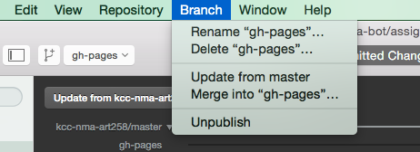

# Week 4: CSS Authoring using Sass


The concept of CSS authoring is based on using additional tools (ie. Prepros) and technologies (ie. Sass) to create a more maintainable and efficient workflow while developing. The final output from your tool's build process will be a compiled and compressed version of your CSS ready for the browser.

**Table of Contents**
<!-- START doctoc generated TOC please keep comment here to allow auto update -->
<!-- DON'T EDIT THIS SECTION, INSTEAD RE-RUN doctoc TO UPDATE -->

- [Preprocessors](#preprocessors)
- [*Prepros* as our build tool](#prepros-as-our-build-tool)
  - [Setup](#setup)
  - [Adding a new project](#adding-a-new-project)
- [Getting started with Sass](#getting-started-with-sass)
  - [Variables](#variables)
  - [Nesting](#nesting)
  - [Mixins](#mixins)
  - [Operators](#operators)
  - [Functions](#functions)

<!-- END doctoc generated TOC please keep comment here to allow auto update -->

## Preprocessors

One of the main technologies you'll interact with as a front-end developer will be CSS preprocessors.

Preprocessors make writing *maintainable* CSS easier. You can get more done, with less code, in less time. There are several popular preprocessors available to choose from including Sass, [LESS](http://lesscss.org/), and [Stylus](http://learnboost.github.io/stylus/). Each preprocessor has the same basic features and concepts:
- Be a *superset* of CSS, ie. valid CSS is valid Sass
- Support for variables, nesting, and basic math functions allowing for creation of [DRY](https://en.wikipedia.org/wiki/Don%27t_repeat_yourself) CSS

Today, the main thing that differs between the major preprocessors is code syntax and a few built-in functions. In this course we'll be focusing on Sass since it is well established and widely used within the community.

References:
- [Sass: Basic Guide](http://sass-lang.com/guide)
- [Sass: Developer Reference](http://sass-lang.com/documentation/file.SASS_REFERENCE.html#parent-selector)

## *Prepros* as our build tool

There are several tools available to assist with managing the build process and generating our preprocessor's output including [Codekit](http://incident57.com/codekit/), [Scout](http://mhs.github.io/scout-app/), and command-line tools like [GruntJS](http://gruntjs.com/) and [GulpJS](http://gulpjs.com/). In this course, we'll be using Prepros which, along with compiling our Sass, also helps out with the following:

- CSS prefixing
- Browser refresh & behavior synchronization
- File concatenation & minification
- Image optimization


### Setup

So let's start by getting our environments setup for CSS authoring. We only have to do this step the first time we open Prepros

- Open Prepros (if you get a trial pop-up, just click okay)
- Click on *App Menu > Project Defaults*


- Under *Compilers > Sass*, make sure **Auto Compile, Autoprefix CSS, Use LibSass, and Sourcemaps** are checked and **Compressed** is selected in the dropdown for *Output style of Output file.*


### Adding a new project

Once you've adjusted the settings, drag & drop your project on to Prepros, or click the `+ Add Project` button on the bottom left corner.


That's it! Prepros will now watch our project for changes and generate the necessary output for us without any extra work. We'll come back to it later, but for now we can minimize the window to get out of our way.

## Getting started with Sass

It may seem daunting at first, but the main thing to remember is that Sass is CSS at it's core, so we can start slow and simple by converting our existing `style.css` to `style.scss`.


Once you re-save `style.scss`, you'll notice that two additional files appear, `style.css` and `style.css.map`.


*The `style.css.map` file is used by debugging tools like Chrome DevTools to read the compiled CSS and lookup the corresponding Sass file.*

We officially have Sass up and running!

### Variables

Variables are a way to store information that you want to reuse throughout your stylesheet. They are one of the critical pieces of making your development process DRY.

You can store things like colors, font stacks, or any CSS value you think you'll want to reuse. Sass uses the $ symbol to make something a variable. See the below CSS from our last class assignment for an example:

```css
.main-header {
  position: relative;
  height: 60px;
  background-color: green;
}

.logo {
  top: 0;
  left: 0;
  height: 60px;
  width: 100px;
  background-color: gray;
}

.main-nav {
  top: 0;
  right: 0;
  height: 60px;
  width: 400px;
  background-color: gray;
}
```

We can simplify this code by reference common values in a variable. For example, we use the value `60px` several times in the above code. If we wanted to change the size of our header, that means we would need to change that number 3 times in our stylesheet, which isn't very *DRY*.

Let's use a Sass variable to simplify our code and make it more efficient.

```scss
// Variables
$header-height: 60px;

.main-header {
  position: relative;
  height: $header-height;
  background-color: green;
}

.logo {
  top: 0;
  left: 0;
  height: $header-height;
  width: 100px;
  background-color: gray;
}

.main-nav {
  top: 0;
  right: 0;
  height: $header-height;
  width: 400px;
  background-color: gray;
}
```

Now if we want to update our header height, we only need to do it in one place. Go ahead and update the stylesheet by converting reused values to variables. A good rule of thumb: if a value (ie. color, number, string) is used 3 or more times anywhere in your stylesheet, it should be a variable.

### Nesting

One thing CSS is missing is a visual hierarchical structure that mimics HTML's nesting structure. Sass will let you nest your styles very much like HTML. When nesting there's 2 basic rules to follow: only be as specific as you need to be (ie. components), and do not nest more than three-levels deep (see [inception rule](http://thesassway.com/beginner/the-inception-rule) below).

Given our previous CSS, let's start with nesting the header.

```scss
// Variables
$header-height: 60px;

.main-header {
  position: relative;
  height: $header-height;
  background-color: green;

  .logo {
	top: 0;
	left: 0;
	height: $header-height;
	width: 100px;
	background-color: gray;
  }

  .main-nav {
	top: 0;
	right: 0;
	height: $header-height;
	width: 400px;
	background-color: gray;
  }
}
```

This will output the below CSS:

```css
.main-header {
  position: relative;
  height: 60px;
  background-color: green;
}

.main-header .logo {
  top: 0;
  left: 0;
  height: 60px;
  width: 100px;
  background-color: gray;
}

.main-header .main-nav {
  top: 0;
  right: 0;
  height: 60px;
  width: 400px;
  background-color: grey;
}
```

Take notice that the parent selector is prepended as an additional selector in the final styles output. This is significant because CSS performance is impacted negatively specifically from multi-selector style rules. This is where the first big rule of Sass comes in:

> **The Inception Rule**: don’t go more than three levels deep.

References:
- [The Sass Way - Nested selectors: The Inception Rule](http://thesassway.com/beginner/the-inception-rule)
- [The Sass Way - Avoid nested selectors for more modular CSS](http://thesassway.com/intermediate/avoid-nested-selectors-for-more-modular-css)
- [Sitepoint - Beware of Selector Nesting in Sass](http://www.sitepoint.com/beware-selector-nesting-sass/)

Continue nesting the stylesheet by thinking in large components (ie. header, hero, info, footer).

### Mixins

Sometimes in CSS you want to reuse more than just a single value, but a whole set of style declarations or rules. Sass mixins fill this void, acting similarly to variables, but for whole sets of style rules.

A good example of when you would want to use a mixin from our current stylesheet would be our clearfix hack. If you have more than 1 section with floated content, then your HTML probably has several `cf` or `clearfix` classes being applied. This is fine, however the only reason we created that class is so that we could reuse the style without having to rewrite it for every selector that needs it in our CSS (**DRY CSS**, *WET HTML*).

With Sass, we can clean up our HTML while also keeping our Sass DRY using a mixin.

```scss
@mixin cf {
  &:before,
  &:after {
	content: "";
	display: table;
  }

  &:after {
	clear: both;
  }
}
```

Notice that I move the name of my class to the mixin name, and replaced it with `&`. In Sass, `&` has a special meaning, allowing you to reference the parent selector. This will become clearer once you see the output below.

Given our current HTML, let's use our `cf` mixin so we can remove the `cf` class from the HTML.

```scss
@mixin cf {
  &:before,
  &:after {
	content: "";
	display: table;
  }

  &:after {
	clear: both;
  }
}

...

.site-info {
  height: auto;
  background-color: purple;
  @include cf;
}
```

This outputs the below CSS:

```css
.site-info {
  height: auto;
  background-color: purple;
}

.site-info:before,
.site-info:after {
  content: "";
  display: table;
}

.site-info:after {
  clear: both;
}
```

Notice that because of the parent selector in our mixin, it applied the pseudo-selector classes directly to the parent selector the mixin was applied in.

Mixins aren't used as commonly as variables and nesting in Sass, but they are definitely handy when you need it. Look at your stylesheet and consider if there are 2 or more elements sharing a set of similar styles that could be encapsulated for reuse.

### Operators

Sometimes you need to do some math in your CSS to get the exact values you need. This becomes extremely handy when working with grids and responsive web design where you're calculating percentages. Sass has a handful of standard math operators like `+`, `-`, `*`, `/`, and `%`. Let's create a dynamic width for our info section using a variable and some basic math.

```css
$site-info-width: 100%;

...

.site-info .info-01,
.site-info .info-02 {
  width: ($site-info-width / 4) - 1;
}

.site-info .info-03 {
  width: ($site-info-width / 2);
}
```

Which should compile to the CSS we previously had:

```css
.site-info .info-01,
.site-info .info-02 {
  width: 24%;
}

.site-info .info-03 {
  width: 50%;
}
```

Some things to keep in mind about math operations in Sass:
- You can't mix value units, ie. `$container-width: 100% - 20px;` will not work compile
- The `/` symbol already has a special value in CSS (ie. font shorthand), so good practice is to wrap expressions in parenthesis if you want to for sure do division on the values.

### Functions

Sass comes with an [extensive set of built-in functions](http://sass-lang.com/documentation/Sass/Script/Functions.html) that help you do common tasks really easy. For example, if you have ever wanted to darken a color on the fly while developing, and then opened up PS or Sketch to eyedrop the color and adjust it, Sass has a handy `darken()` function that let's you pass in a color and degree to darken by. Let's darken some of our colors using the handy function:

```css
body {
  background-color: darken(#FFCC00, 10%);
}
```

Sass also provides users the ability to create their own custom functions in Sass. These are similar to mixins, except instead of outputting a set of styles, functions return a single value like variables. The difference between a function and a variable is that a function can manipulate a value before it returns it. This is extremely handy for performing common calculations (using operators) , ie. calculating dynamic grid widths, creating typographic scales, converting units (px to em).

We'll cover custom functions in more depth in the coming weeks when we work on CSS frameworks; for now just know that built-in functions are available to you and you also have the ability to create custom functions if needed.

## In-Class Exercise
- Switch back to the `master` branch in your local `<username>/assignments` project in GitHub Desktop
- Update from `kcc-nma-art258/assignments:master` branch to get the latest changes
- Create a new branch called `week-4-assignment` and convert the in-class example to Sass

## Homework
Once completed with the in-class exercise...
- Rename `gh-pages` to `week-3-basic-site`. Publish the `week-3-basic-site` branch. Switch back to the `gh-pages` branch. _(We're simply making a copy of `gh-pages` so we can keep working on it, but go back to the previous version if we need)_



- Convert your existing CSS in to Sass following the class guide
- Make commits to save your changes and sync with your GitHub account online once you are complete
- Add the link to your assignment site on your GitHub repo pages


- Create a pull request with the title `NMA Bot - Assignment 3: Sass` (replacing *NMA Bot* with your name) to turn in your project by 11:59pm Monday night.
  - Make sure to mention atleast two people in your pull request; try to finish early enough so you can give other students enough time to review your work, not at the last minute.
  - Adding the link to your assignment site in your pull request description will help your classmates review your work in the browser easier.

 - The assignment will use the following grading requirements: include one example of a **[variable](#variables)**, **[nesting](#nesting)**, **[mixins](#mixins)**
