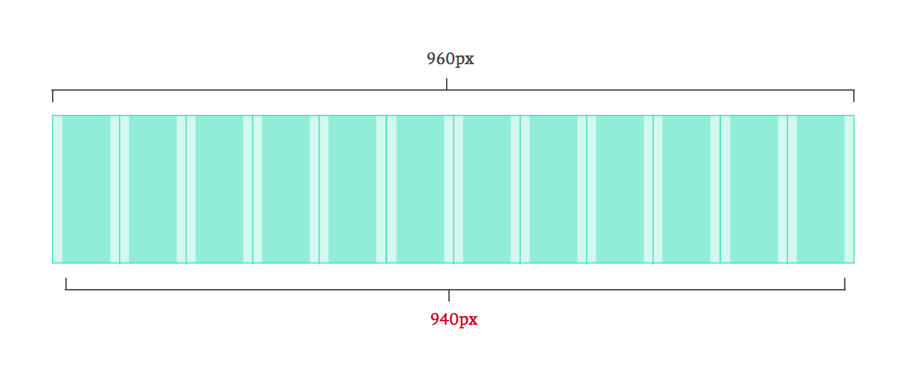

# Week 5: CSS Architecture & Frameworks

Replicating visual designs perfectly in code is just one side and challenge of writing CSS. As you begin to write CSS for larger sites and applications, additional considerations need to be taken in to account, including:

- Is the code readable/understandable?
- Is the code easy to change or extend?
- Is the code well decoupled?
- Will the code scale?

By focusing on good CSS architecture, we can answer yes to the above questions and have confidence that our code will stand the test of time.

**Table of Contents**

<!-- START doctoc generated TOC please keep comment here to allow auto update -->
<!-- DON'T EDIT THIS SECTION, INSTEAD RE-RUN doctoc TO UPDATE -->


- [Structuring your stylesheets](#structuring-your-stylesheets)
  - [Folder structure](#folder-structure)
    - [Base](#base)
    - [Layout](#layout)
    - [Modules](#modules)
    - [Pages](#pages)
  - [Connecting them all together](#connecting-them-all-together)
- [General guidelines for CSS architecture:](#general-guidelines-for-css-architecture)
- [Resources](#resources)
- [CSS Frameworks](#css-frameworks)
  - [Grids](#grids)
    - [Container](#container)
    - [Rows](#rows)
    - [Columns](#columns)
      - [Column widths](#column-widths)
      - [Column gutters](#column-gutters)
  - [Responsive grids](#responsive-grids)
    - [Our complete grid](#our-complete-grid)
- [Homework](#homework)

<!-- END doctoc generated TOC please keep comment here to allow auto update -->

## Structuring your stylesheets

One of the nice things about Sass is that it allows for a more sophisticated project structure than CSS out-of-the-box. Sass extends the [`@import`](http://sass-lang.com/documentation/file.SASS_REFERENCE.html#import) rule to allow import of SCSS and Sass files. Unlike the normal `@import` rule, in Sass, the imported files will be merged into a single CSS output file.

So lets take a look at how we can use Sass & `@import` to structure our project:

### Folder structure

First thing is to setup your folder structure; we'll explain what each of these mean here shortly.

```
styles/
|
|-- base/
|-- layout/
|-- modules/
|-- pages/
|   
|-- reset.css
|-- style.css
|-- style.css.map
|-- style.scss
```

As we move through each section, we'll create a partial `.scss` file, with just the styles we need, and then in the end, we'll include them all back together.

#### Base
`base/` is where all of your foundational styling is going to go. Typically in this folder, you'll find a reset, typography styles, and handy sass utilities like variables, functions, and mixins.

Let's move our `reset.css` in to our `base/` and then rename it `_reset.scss` (we'll explain what the underscore at the beginning here means at the end). Let's also go ahead and remove it from our HTML.

Create a new file called `_utilities.scss` and move all of the variables and @mixins (not `@extend`) from `style.scss` here.

Now our folder structure should look like this:

```
styles/
|
|-- base/
|   |-- _reset.scss
|   |-- _utilities.scss
|
|-- layout/
|-- modules/
|-- pages/
|   
|-- style.css
|-- style.css.map
|-- style.scss
```

Specifically, the new files we added were:
- `_reset.scss`
- `_utilities.scss`

#### Layout
The `layout/` directory (sometimes called `partials`) is where the styles for our large sections of layout _which are shared across the site_ will go. This is where our grid as well as the common areas live, like our header, footer, etc.

Let's create the following files and move our styles from `style.scss` to their respective place:

- `_header.scss`
- `_footer.scss`
- `_grid.scss`

*(We haven't created a grid yet, so for now we can just move our `.container` class in to it)*

Now our folder structure should look like this:

```
styles/
|
|-- base/
|   |-- _reset.scss
|   |-- _utilities.scss
|
|-- layout/
|   |-- _header.scss
|   |-- _footer.scss
|   |-- _grid.scss
|
|-- modules/
|-- pages/
|   
|-- style.css
|-- style.css.map
|-- style.scss
```

Our `style.scss` should also be getting smaller...

#### Modules
The `modules/` directory (sometimes called `components/`) is for the smaller portions of the design which make up the major layout sections. While `layout/` is kind of _macro_ (defining the global wireframe), `modules/` is more _micro_. This is usually where most of the files live, since your whole site _should_ be made up of small modules.

For our site, let's create the following modules and move their respective styles in to it from the `style.scss`:
- `_hero.scss`
- `_search-bar.scss`
- `_site-info.scss`

Now our folder structure should look like this:

```
styles/
|
|-- base/
|   |-- _reset.scss
|   |-- _utilities.scss
|
|-- layout/
|   |-- _header.scss
|   |-- _footer.scss
|   |-- _grid.scss
|
|-- modules/
|   |-- _hero.scss
|   |-- _search-bar.scss
|   |-- _site-info.scss
|   
|-- pages/
|
|-- style.css
|-- style.css.map
|-- style.scss
```

...and our `style.scss` should be empty now, but there is still one more folder to share.

#### Pages
The `pages/` folder is where all of the page specific styles go that don't make up the `layout/` or belong to a `module`.

Since we're only working with a single page HTML/CSS wirefame, we don't have any traditional "page" types styles yet, but as we go on, we'll need to setup styles that are unique for certain pages, ie. the home page. We would do that with the following:
- `_home.scss`

### Connecting them all together

Since we broke everything out in to separate files, our `style.scss` (and subsequently our `style.css`) is completely blank. This is where Sass's import comes in:

**styles/style.scss**
```scss
// Base
@import "base/reset";
@import "base/utilities";

// Layout
@import "layout/header";
@import "layout/footer";
@import "layout/grid";
// ...

// Modules
@import "modules/hero";
@import "modules/search-bar";
@import "modules/site-info";

// Pages
// ...
```

You'll notice that we didn't have to include the `_` or the `.scss` extension; this is because Sass is smart enough to know just by looking at the file.

By giving the files a underscore (`_`) at the beginning of their name, Sass knew to only import the stylesheet in to another. However since we didn't give our `style.scss` an `_`, Sass also knew to go ahead and read the file, import everything and then compile it in to a final `style.css` file.

Now we're ready to grow our CSS with our site! However, this is simply one recommendation for structuring based on research and personal experience, however there are other techniques you may read about online which I encourage you to try.

## General guidelines for CSS architecture:
- Use an underscore (`_`) if you plan to `@import` the file in to another stylesheet
- If a file starts to get longer than 200 lines, consider splitting it in to smaller chunks.
  - **Ex 1:** if you notice your `_header.scss` is growing, you can break out the styles in to a `_navigation.scss` file
  - **Ex 2:** if you find that your utilities is growing, you can split them up in to separate `_variables.scss`, `_mixins.scss`,
`_functions.scss`, etc.
- If you can't figure out where a style should go, ie. _"Does it belong in a layout, module or page style"_, just ask yourself if you ever plan to reuse that style anywhere else on the site:
  - used multiple times + a big section == `layout/`
  - used multiple times + smaller section == `module/`
  - only used for one page, no matter the size == `pages/`
- If you are including files from other sources, ie. `animate.scss`, you can add a `vendor/` directory to organize code from vendor sources.

## Resources
- [How to structure a Sass project](http://thesassway.com/beginner/how-to-structure-a-sass-project)
- [Sitepoint: Architecture for a Sass Project](http://www.sitepoint.com/architecture-sass-project/)

## CSS Frameworks

When developing websites, especially in the early stages of prototyping, it can be helpful to reuse code to solve common problems.

> “[Framework is] a set of tools, libraries, conventions, and best practices that attempt to **abstract routine tasks into generic modules that can be reused**. The goal here is to allow the designer or developer to focus on tasks that are unique to a given project, rather than reinventing the wheel each time around.” [[Framework For Designers](http://www.alistapart.com/articles/frameworksfordesigners), by _Jeff Croft_] 

While popular frameworks like [Foundation](http://foundation.zurb.com) and [Bootstrap](http://getbootstrap.com) are a great base, they have their own generic design opinion and may not match your own particular coding style. A few reasons why creating your own custom framework is a good idea:

- Increase your productivity and avoid common mistakes.
- Develop a common set of styles which match more closely to your own design style. 
- Tailor specific CSS to your needs. If you need specific elements (like footers, widgets, comments, feeds etc.), style your own commonly used web elements
- Write minimal-to-no code while prototyping; write only unique code while developing

At a hight level, the basic building blocks involved in a CSS framework are:
- Grid
- Typography
- Base layout
- Form elements & controls

We can always add more styles to our framework, but this is a good place to start.

### Grids

The first and most important part of creating your own framework is developing a grid. Grids help us establish a consistent rhythm and create proper proportions throughout our design.

CSS grids contain a few common elements which should look and feel familiar:


A CSS grid contains the following components, similar to a print grid:
- container
- rows
- columns
- gutters (space inbetween columns)

#### Container
Grids start with a wrapping container, which we already have. Below are the changes we need to make:

**layouts/_grid.scss**

```scss
.container {
  width: 100%;
  max-width: 960px;
  margin: 0 auto;

  * {
    box-sizing: border-box;
  }
}
```
We're essentially saying that our grid should be 100% width on screens equal to or less than 960px.

#### Rows

A row is essentially our container for columns and structuring vertical rhythm on the page. We'll be floating our columns, so we need to make sure that our rows are cleared (using our clearfix mixin).

```scss
.row {
  @include cf;
}
```

#### Columns

Columns are the tricky part! While there are many ways to position things in CSS, the `float` property is actually the most straight-forward and bulletproof way of creating column layouts.

```css
[class^='col-'] {
  float: left;
  min-height: 1px; 
}
```

That fancy selector up there is known as an [_attribute selector_](https://developer.mozilla.org/en-US/docs/Web/CSS/Attribute_selectors), and it essentially lets us style elements in CSS using more sophisticated targeting. Here we are saying _"style any element with a class name that **starts with** `col-`"_. That naming structure will make sense here shortly.

We also want to give our columns a `min-height: 1px` so they don't overlap if there is no content.

##### Column widths

Column widths can be calculated using some basic math. Since our `.container` has a `width: 100%`, then our column classes are just **100 divided by the number of columns**. We're going to start with a 12 column grid and use Sass to generate our grid columns widths automatically.

```scss
@for $i from 1 through 12 {
  .col-#{$i} { 
    width: 100% / $i; 
  }
}
```

That fancy piece of code up there is called a _"for loop"_ using Sass's [`@for` directive](http://sass-lang.com/documentation/file.SASS_REFERENCE.html#_10). What it does is repeat the code inside the outer brackets as many times as the number after "through". Let's see what it outputs:


```css


.col-1 {
  width: 100%;
}

.col-2 {
  width: 50%;
}

.col-3 {
  width: 33.33333%;
}

.col-4 {
  width: 25%;
}

.col-5 {
  width: 20%;
}

.col-6 {
  width: 16.66667%;
}

.col-7 {
  width: 14.28571%;
}

.col-8 {
  width: 12.5%;
}

.col-9 {
  width: 11.11111%;
}

.col-10 {
  width: 10%;
}

.col-11 {
  width: 9.09091%;
}

.col-12 {
  width: 8.33333%;
}
```

**So how did that work?**

In our `@for` loop, `$i` represents the current number in the loop, so each time it loops, it increments the current number, and we can use that to give our columns class names a unique postfix and within our math expression to create the appropriate grid widths. Pretty awesome right?!

##### Column gutters

This is where `box-sizing: border-box` is extremely helpful. Since the `border-box` setting means that our padding will not affect the width, we can add padding to our main `.col-` class and everything should remain intact.

```css
[class^='col-'] {
  float: left;
  min-height: 1px; 
  padding: 0 1em;
}
```
This almost perfect, except are columns technically don't reach the edge, so our layout _appears_ `940px` wide instead of `960px`.



We just need to do a little bit of CSS magic to get our layout to render as expected.

```scss
.row {
  margin-left: -1em;
  margin-right: -1em;
  @include cf;
}
```

The negative margins on the parent row will counteract the left padding and right padding of the first and last column, respectively.


**Now we have a basic grid:**

**grid.html**
```html
<div class="container">
  <div class="row">
        <div class="col-1">1</div>  
    </div> 
    <div class="row">
        <div class="col-2">2</div> 
        <div class="col-2">2</div> 
    </div> 
    <div class="row">
        <div class="col-3">3</div> 
        <div class="col-3">3</div> 
        <div class="col-3">3</div> 
    </div> 
    <div class="row">
        <div class="col-4">4</div> 
        <div class="col-4">4</div> 
        <div class="col-4">4</div> 
        <div class="col-4">4</div> 
    </div> 
    <div class="row">
        <div class="col-5">5</div> 
        <div class="col-5">5</div> 
        <div class="col-5">5</div> 
        <div class="col-5">5</div> 
        <div class="col-5">5</div> 
    </div> 
    <div class="row">
        <div class="col-6">6</div> 
        <div class="col-6">6</div> 
        <div class="col-6">6</div> 
        <div class="col-6">6</div> 
        <div class="col-6">6</div>
        <div class="col-6">6</div>
    </div>  
    <div class="row">
        <div class="col-7">7</div> 
        <div class="col-7">7</div> 
        <div class="col-7">7</div> 
        <div class="col-7">7</div> 
        <div class="col-7">7</div>
        <div class="col-7">7</div> 
        <div class="col-7">7</div> 
    </div>
    <div class="row">
        <div class="col-8">8</div> 
        <div class="col-8">8</div> 
        <div class="col-8">8</div> 
        <div class="col-8">8</div> 
        <div class="col-8">8</div>
        <div class="col-8">8</div> 
        <div class="col-8">8</div> 
        <div class="col-8">8</div> 
    </div> 
    <div class="row">
        <div class="col-9">9</div> 
        <div class="col-9">9</div> 
        <div class="col-9">9</div> 
        <div class="col-9">9</div> 
        <div class="col-9">9</div>
        <div class="col-9">9</div> 
        <div class="col-9">9</div> 
        <div class="col-9">9</div> 
        <div class="col-9">9</div> 
    </div> 
    <div class="row">
        <div class="col-10">10</div> 
        <div class="col-10">10</div> 
        <div class="col-10">10</div> 
        <div class="col-10">10</div> 
        <div class="col-10">10</div>
        <div class="col-10">10</div> 
        <div class="col-10">10</div> 
        <div class="col-10">10</div> 
        <div class="col-10">10</div> 
        <div class="col-10">10</div> 
    </div> 
    <div class="row">
        <div class="col-11">11</div> 
        <div class="col-11">11</div> 
        <div class="col-11">11</div> 
        <div class="col-11">11</div> 
        <div class="col-11">11</div>
        <div class="col-11">11</div> 
        <div class="col-11">11</div> 
        <div class="col-11">11</div> 
        <div class="col-11">11</div> 
        <div class="col-11">11</div> 
        <div class="col-11">11</div> 
    </div> 
    <div class="row">
        <div class="col-12">12</div> 
        <div class="col-12">12</div> 
        <div class="col-12">12</div> 
        <div class="col-12">12</div>
        <div class="col-12">12</div> 
        <div class="col-12">12</div> 
        <div class="col-12">12</div> 
        <div class="col-12">12</div> 
        <div class="col-12">12</div> 
        <div class="col-12">12</div>
        <div class="col-12">12</div> 
        <div class="col-12">12</div> 
    </div>
</div>
```
Now that we have our grid, let's make it responsive!

### Responsive grids

Now that we have our grid, making it accommodate smaller screens is relatively simple and straightforward from here. For simplicity, general best practice for smaller screens is to make your columns `width: 100%;` and to stack them up:

```scss
[class^='col-'] {
  width: 100%;
  float: left;
  min-height: 1px; 
  padding: 0 1em;
}

@for $i from 1 through 12 {
  .col-#{$i} { 
    @media screen and (min-width: 600px){
      width: 100% / $i; 
    }
  }
}
```

**What's going on here?**

The first thing we did is give all elements matching the `.col-` class name scheme a `width: 100;`. This gives us the styling we need, but we only want it to apply when we're on small screens. In our `@for` loop, we've wrapped our width styles in a media query that is applied on screens **larger than 600px width**. 

So... if the screen size is less than 600px, our columns are 100% width; anything larger than 600px gets our specific `.col-` class width sizes.

#### Our complete grid

**layouts/_grid.scss**
```scss
.container {
  width: 100%;
  max-width: 960px;
  margin: 0 auto;
}

.row {
  margin-left: -1em;
  margin-right: -1em;
  @include cf;
}

[class^="col-"] {
  width: 100%;
  float: left;
  min-height: 1px; 
  padding: 0 1em;
}

@for $i from 1 through 12 {
  .col-#{$i} { 
    @media screen and (min-width: 600px){
      width: 100% / $i; 
    }
  }
}
```

## Homework
- Rename `gh-pages` to `assignment-4`. Publish the `assignment-4` branch. Switch back to the `gh-pages` branch. _(We're simply making a copy of `gh-pages` so we can keep working on it, but go back to the previous version if we need)_


- Structure your existing SCSS following the class guide
- Make commits to save your changes and sync with your GitHub account online once you are complete
- Add the link to your assignment site on your GitHub repo pages


- Create a pull request with the title `NMA Bot - Assignment 4: CSS Architecture` (replacing *NMA Bot* with your name) to turn in your project by 11:59pm Monday night.
  - Make sure to mention atleast two people in your pull request; try to finish early enough so you can give other students enough time to review your work, not at the last minute.
  - Adding the link to your assignment site in your pull request description will help your classmates review your work in the browser easier.

 - The assignment will use the following grading requirements: site should include `base/`, `layout/`, `modules/`, and `pages/` directories with atleast one example of a sass file in each. Your main `style.scss` file should include multiple imports, and the final output `style.css` should be relatively similar to the previous homework, barring file reordering.
